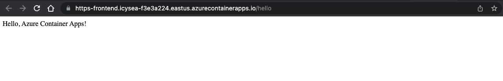
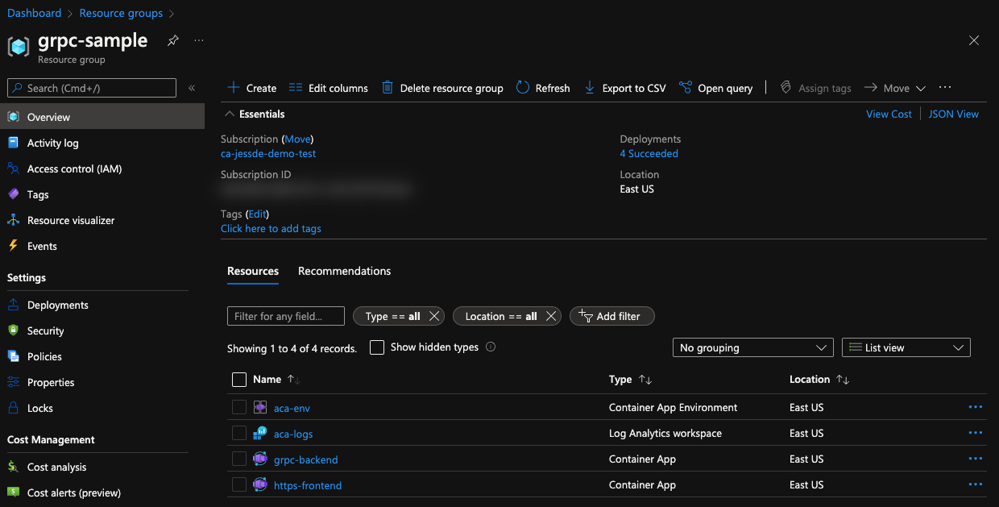

# Ghost Blog Standalone Container App w/ Debug Script

One click [Ghost blog]() deployment using Azure Container Apps, Azure Database, Azure Frontdoor, and Azure Keyvault.

[](https://portal.azure.com/#create/Microsoft.Template/uri/https%3A%2F%2Fraw.githubusercontent.com%2Fjldeen%2Fcontainer-app-bicep%2Fghost%2Fmain.json)

<!-- ## Objectives 

This demo is the Azure Bicep version of [Jeff Hollan's gRPC Sample Python App](https://github.com/jeffhollan/grpc-sample-python) for Azure Container Apps. 

This is a sample of a gRPC client calling another container running a gRPC server to execute a `SayHello` call.

To simplify the deployment experience, there are abstracted Azure Bicep files located in the `./modules` folder within this repo.

### Requirements

* [Azure CLI v2.30.0](https://docs.microsoft.com/cli/azure/install-azure-cli)
* [Azure Account](https://azure.microsoft.com/free/)
* [Azure Container Apps Extension Enabled](https://docs.microsoft.com/en-us/azure/container-apps/get-started?tabs=bash#setup)

## Run gRPC Sample App 

Starting from the root of this folder, please login to Azure 

```bash
  az login
```

Set the desired subscription.

```bash
  az account set --subscription <id or name>
```

Ensure the Azure Container Apps extension is installed for your Azure CLI.

```bash
    az extension add --source https://workerappscliextension.blob.core.windows.net/azure-cli-extension/containerapp-0.2.0-py2.py3-none-any.whl
```

Register the `Microsoft.Web` Namespace
   
```bash
    az provider register --namespace Microsoft.Web
```

Now we can deploy the app, as well as all required resources, by simply running the `deploy.sh` script for bash / zsh. 

This script takes the following optional arguments:

1. `Resource Group Name`: The name of your resource group created in Azure. Default value is: `grpc-sample`
2. `location`: This is the location your resources will be deployed. Default value is: `eastus`

If the default values work for you, simply run the following to deploy this demo:

```bash
    ./deploy.sh
```

If you would like to provide your own resource group name and location, run the following to deploy this demo with your preferred arguments supplied:

```bash
    ./deploy.sh myResourceGroupName canadacentral
```

The deploy script will run and will create 4 resources in the resource group name you chose:

* Container App Environment
* Log Analytics Workspace
* Container App (grpc-backend)
* Container App (https-frontend)

After the script completes, you will see output similar to the following:

```bash
    Your app is accessible from http://https-frontend.icysea-f3e3a224.location.azurecontainerapps.io/hello

```
Simply click the link provided from the script to test the Azure Container App Deployment. A successful deployment will provide the following in your browser:



If you navigate to your Azure Portal, and to your created resource group, you will see resources similar to this:



## Bicep Templates Module Info

| Module | Details |
|--------|--------|
| createContainerApp.bicep | Creates Azure Container App Resource |
| createContainerAppEnv.bicep | Creates Azure Container App Environment Resource |
| createLogAnalytics.bicep | Creates Log Analytics Resource |

To deploy the 3 modules with the sample code from Jeff's repo, you will use the `main.bicep` file with the following parameters:

### Required Parameters
| Main Bicep | Required Parameters |
|--------|--------|
| rgName | Resource Group Name |
| location | Location of Azure Resources and Resource Group |

### Optional Parameters
| Main Bicep | Optional Parameters |
|--------|--------|
| containerImage | Container Image for Azure Container App |
| containerPort | The port your container listens to for incoming requests. Your application ingress endpoint is always exposed on port 443  |
| useExternalIngress | Set whether you want your ingress visible externally, or internally within a VNET |
| transportMethod | Transport type for Ingress. Options include `auto` `http` or `http2` |
| environmentVariables | Environment Variables needed for your container apps | -->